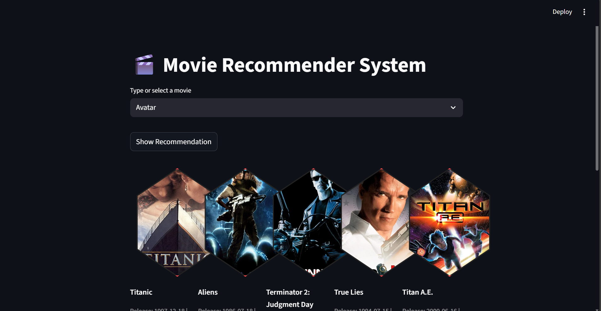
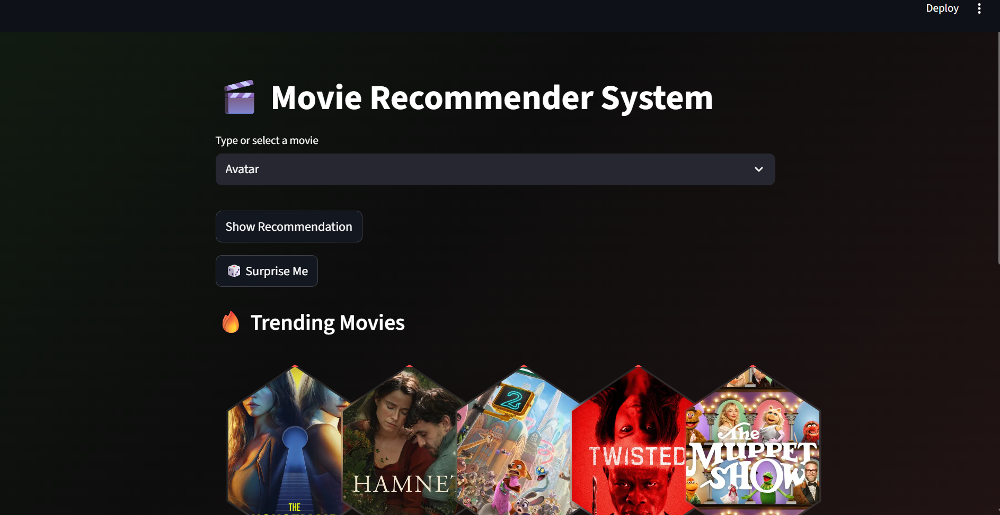
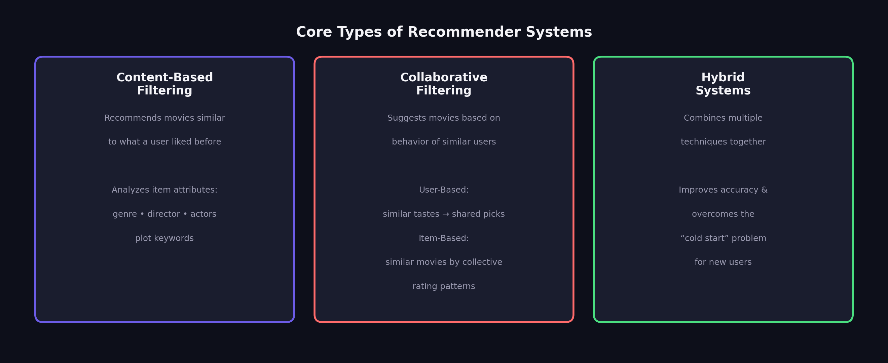
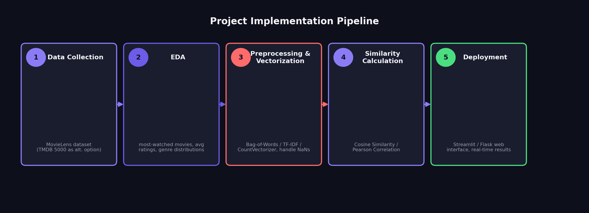
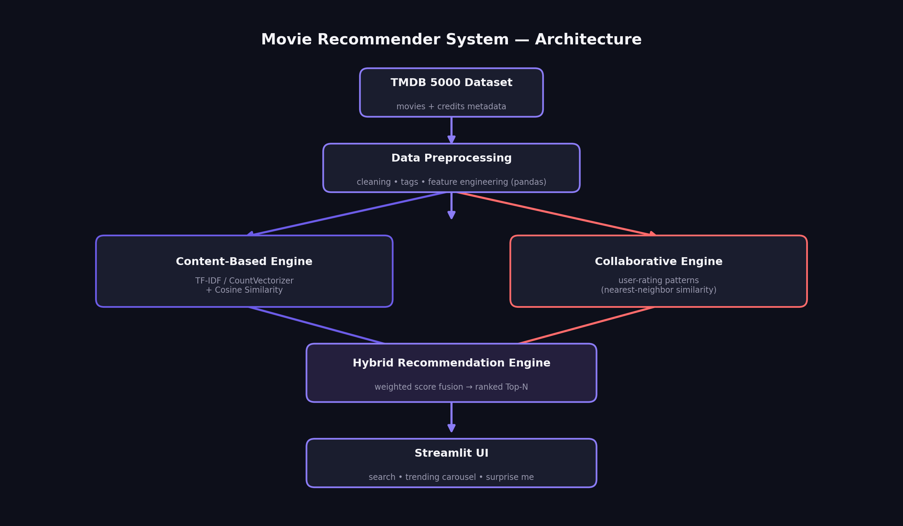
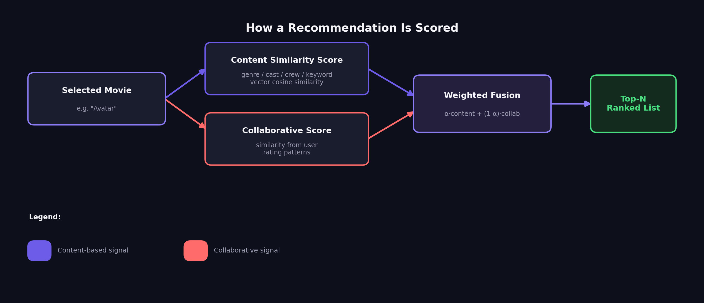

<div align="center">

# 🎬 Movies-Recommender-System

### A machine learning-based movie recommendation engine using collaborative filtering & content similarity

[](https://www.python.org/)
[](https://scikit-learn.org/)
[](https://streamlit.io/)
[](https://grouplens.org/datasets/movielens/)


<br>

**Get personalized, accurate movie recommendations** based on your preferences — powered by collaborative filtering and item similarity analysis.

[🚀 Live Demo](#-live-demo) • [✨ Features](#-features) • [🧠 Core Concepts](#-core-types-of-recommender-systems) • [🛠️ Implementation](#️-project-implementation-steps) • [⚙️ Installation](#️-installation) • [📁 Structure](#-project-structure)

</div>

<br>

---

## 🌟 Overview

The **Movie Recommendation System** is a machine learning-based application that provides **personalized movie recommendations** to users. It utilizes **collaborative filtering** techniques to analyze user preferences and similarities among movies to generate accurate and relevant recommendations. The system is built using **Python** and incorporates popular machine learning libraries such as **scikit-learn** and **pandas**.

The project uses the **MovieLens dataset**, a widely used dataset in the field of recommender systems, containing movie ratings and metadata. The dataset is preprocessed to create a **user-item matrix** and to calculate **item similarity using cosine similarity**. This enables the system to identify movies similar to ones the user has previously enjoyed and recommend them accordingly.

The recommendation process takes a **user's unique identifier** as input and generates a list of **top-rated movie recommendations** tailored to their preferences. The system dynamically adjusts and updates recommendations as new data becomes available.

This project is intended for individuals who seek personalized movie suggestions to enhance their movie-watching experience, and can be integrated into platforms such as streaming services, movie review websites, or personal movie catalog apps.

<br>

## 📸 Live Demo

<div align="center">

### 🔍 Search & Get Instant Recommendations
Type any movie — the engine returns similar picks in a hexagon poster grid.



<br><br>

### 🔥 Trending Movies & Surprise Me
Browse trending titles or let the app pick something unexpected for you.



</div>

<br>

## ✨ Features

<table>
<tr>
<td width="50%" valign="top">

### 🎯 Personalized Recommendations
Generates top-rated movie lists tailored to a specific user's taste using collaborative filtering.

### 🔎 Instant Search
Type-ahead dropdown to find and select any movie in seconds.

### 🔄 Dynamic Updates
Recommendations adjust automatically as new rating data becomes available.

</td>
<td width="50%" valign="top">

### 🔥 Trending Carousel
A rotating "Trending Movies" rail highlights currently popular titles.

### 🖼️ Poster-Driven UI
Hexagon-tiled poster cards with title + release date, wrapped in a modern dark theme.

### ⚡ Similarity-Powered
Uses cosine similarity / Pearson correlation over a user-item matrix for fast, relevant matches.


</td>
</tr>
</table>

<br>

## 🧠 Core Types of Recommender Systems

<div align="center">

</div>

| Type | How it works |
|---|---|
| **Content-Based Filtering** | Recommends movies similar to those a user liked in the past, by analyzing item attributes like genre, director, actors, and plot keywords. |
| **Collaborative Filtering** | Suggests movies based on the behavior of similar users. **User-Based:** finds users with similar tastes and recommends what they watched. **Item-Based:** identifies similar movies based on how all users have rated them collectively. |
| **Hybrid Systems** | Combines multiple techniques (e.g. content-based + collaborative) to improve accuracy and overcome limitations like the **"cold start" problem** (difficulty recommending for new users). |

<br>

## 🛠️ Project Implementation Steps

<div align="center">

</div>

1. **Data Collection** — Use popular datasets like **MovieLens** (contains millions of ratings) or the **TMDB 5000 Movie Dataset** (includes detailed metadata like cast and crew).
2. **Exploratory Data Analysis (EDA)** — Visualize data to find the most-watched movies, average ratings, and genre distributions using libraries like **Matplotlib** and **Seaborn**.
3. **Preprocessing & Vectorization** — Convert textual data (tags, overviews) into numerical vectors using techniques like **Bag-of-Words**, **TF-IDF**, or **CountVectorizer**. Handle missing values (NaNs) and normalize ratings to remove user bias.
4. **Similarity Calculation** — Use metrics like **Cosine Similarity** or **Pearson Correlation** to measure how closely related two movies or users are.
5. **Deployment** — Build a web interface using frameworks like **Streamlit** or **Flask** to allow users to search for a movie and receive real-time recommendations.

<br>

## 🛠️ Common Tools & Libraries

<div align="center">

| Category | Tools |
|---|---|
| **Programming Language** | Python (most common) or R |
| **Data Handling** | Pandas, NumPy |
| **Machine Learning** | Scikit-learn — for vectorization and similarity |
| **Advanced Models** | Surprise (for collaborative filtering) or TensorFlow/PyTorch (for deep learning-based approaches) |
| **Visualization** | Matplotlib, Seaborn |
| **Deployment** | Streamlit / Flask |
| **Dataset** | [MovieLens](https://grouplens.org/datasets/movielens/) (primary) / [TMDB 5000](https://www.kaggle.com/datasets/tmdb/tmdb-movie-metadata) (alt.) |

</div>

<br>

## ⚙️ Installation

```bash
# 1. Clone the repository
git clone https://github.com/<your-username>/Movies-Recommender-System.git
cd Movies-Recommender-System

# 2. Create a virtual environment (recommended)
python -m venv venv
source venv/bin/activate      # On Windows: venv\Scripts\activate

# 3. Install dependencies
pip install -r requirements.txt

# 4. Run the app
streamlit run app.py
```


<br>

## 🚀 Usage

1. Open the app and use the **"Type or select a movie"** dropdown, or enter a user ID.
2. Click **Show Recommendation** to get a hexagon grid of similar / top-rated movies.
3. Scroll down to **🔥 Trending Movies** to browse what's currently popular.
4. Recommendations refresh automatically as the underlying rating data updates.

<br>

 

## 📁 Project Structure

```
Movies-Recommender-System/
│
├── app.py                     # Streamlit application entry point
├── recommender/
│   ├── content_based.py       # Content-based similarity engine
│   ├── collaborative.py       # User-based / item-based collaborative filtering
│   └── utils.py                # Preprocessing & vectorization helpers
├── data/
│   ├── movielens_ratings.csv
│   └── movielens_movies.csv
├── notebooks/
│   └── eda.ipynb              # Exploratory Data Analysis
├── models/
│   └── similarity_matrix.pkl  # Precomputed similarity matrix
├── assets/                    # Screenshots & diagrams (this README)
├── requirements.txt
└── README.md
```

<br>

## 🗺️ Roadmap

- [ ] Add hybrid recommendation mode (content + collaborative fusion)
- [ ] Deep learning-based recommendations (TensorFlow/PyTorch)
- [ ] User authentication + personalized watchlists
- [ ] Genre/mood-based filters
- [ ] Deploy public live demo link


 

<br>

## 🤝 Contributing

Contributions, issues, and feature requests are welcome!
1. Fork the repo
2. Create your feature branch (`git checkout -b feature/amazing-feature`)
3. Commit your changes (`git commit -m 'Add amazing feature'`)
4. Push to the branch (`git push origin feature/amazing-feature`)
5. Open a Pull Request

<br>


## 🙏 Acknowledgements

- [MovieLens](https://grouplens.org/datasets/movielens/) (GroupLens Research) for the ratings dataset
- [TMDB](https://www.themoviedb.org/) for supplementary metadata
- [Streamlit](https://streamlit.io/) for the app framework

<br>

<div align="center">

**⭐ If you found this project interesting, consider giving it a star!**

</div>